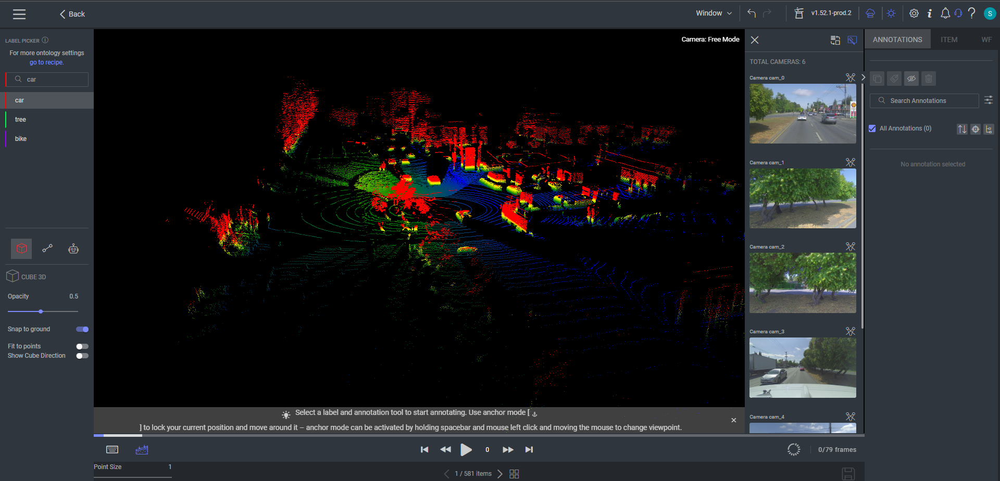

# Dataloop Lidar Ground Detection

  

---

## Description

Ground detection is a LiDAR Pre-processing to detect ground points in Point cloud data Sequences.

The ground detection model is based on [GndNet](https://github.com/anshulpaigwar/GndNet) Model.

