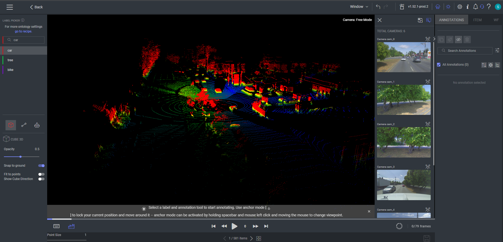

# Dataloop Lidar Ground Detection


<p align="center">
  <a href="https://dataloop.ai/about/"> </a>
</p>

[](https://github.com/dataloop-ai/dtlpy)

---

## Description

Ground detection is a LiDAR Pre-processing to detect ground points in Point cloud data Sequences.

The ground detection model is based on [GndNet](https://github.com/anshulpaigwar/GndNet) Model.


## How to use locally

1. Clone the repository
```bash
git clone https://github.com/dataloop-ai-apps/GndNet
```

2. Run the commands on the [build.sh](build.sh) file:
```bash
pip install -r requirements.txt
pip install torch torchvision torchaudio --index-url https://download.pytorch.org/whl/cu118
```

3. On a given remote `dl.Item`, run the following script:
```bash
import dtlpy as dl
from model_adapter import ModelAdapter


if __name__ == '__main__':
    item = dl.items.get(item_id="item_id")

    model_adapter = ModelAdapter(model_entity=None)
    model_adapter.load(local_path=None)
    model_adapter.predict_items(items=[item])
```